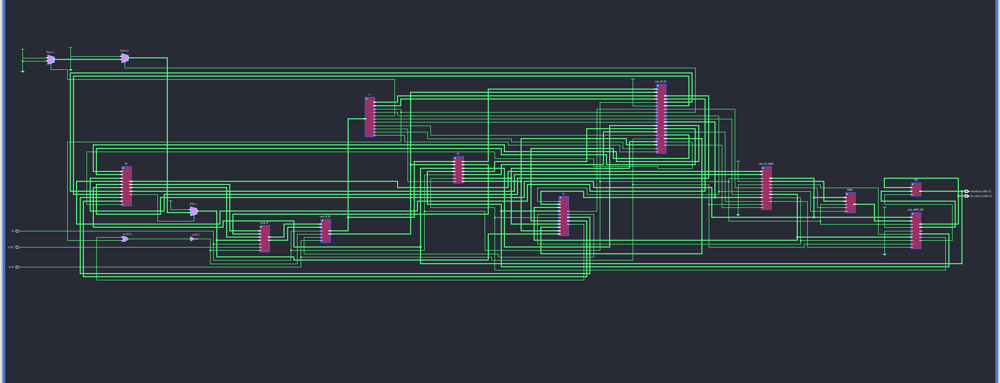

# 5-Stage Pipelined MIPS32 Processor

  

A fully synthesized, cycle-accurate implementation of a **32-bit MIPS Processor**. This project demonstrates the evolution of computer architecture from a functional **Single-Cycle** baseline to a high-performance **5-Stage Pipelined** microarchitecture with advanced hazard resolution.

> **Key Achievement:** Implemented a conflict-free pipeline capable of executing dependent arithmetic instructions with **Zero Stalls** via data forwarding, and handling complex control flow (Recursion/Function Pointers) via a prioritized Master PC Unit.

---

## 🏛️ Architecture Overview

The repository houses two distinct microarchitectures, allowing for performance comparison and design iteration study.

### 1. The Pipelined Core (Advanced)
A modular, hierarchical design split into 5 stages (`IF`, `ID`, `EX`, `MEM`, `WB`) to maximize instruction throughput.

#### **Key Technical Features:**
* **Hierarchical RTL Design:** Logic is encapsulated in stage-specific modules (e.g., `ID_Stage.v`, `Hazard_Unit.v`) ensuring clean synthesis and easy debugging.
* **Robust Hazard Management:**
    * **Data Hazards (RAW):** Resolved via a dedicated **Forwarding Unit** that bypasses data from MEM and WB stages directly to the ALU inputs in EX.
    * **Load-Use Hazards:** Detected automatically to insert a single-cycle hardware stall (bubble) only when necessary.
    * **Control Hazards:** Implements **Static Branch Prediction (Not-Taken)** with automatic pipeline flushing in the ID and EX stages upon misprediction.
* **Advanced Control Flow:**
    * **Master PC Arbitration:** A 4-way prioritized Mux in the Fetch stage arbitrates between Branch Targets, Register Jumps, Immediate Jumps, and Sequential PC.
    * **Function Support:** Full support for `jal` (Call) and `jr` (Return) instructions, enabling C-style function calls and recursion.
 
  
### RTL Schematic
The synthesized design clearly shows the 5-stage separation with inter-stage pipeline registers buffering control and data signals.



### 2. The Single-Cycle Core (Baseline)
The initial functional prototype where every instruction completes in one long clock cycle. Used as the "Golden Model" for verifying the pipeline's correctness.

---

## ⚙️ Instruction Set Architecture (ISA)

The processor implements a subset of the MIPS32 ISA, supporting Register-Register, Immediate, Memory, and Control Flow operations.

| Instruction | Type | Addressing Mode | Pipeline Resolution | Description |
| :--- | :--- | :--- | :--- | :--- |
| `add`, `sub`, `and`, `or`, `mul` | R-Type | Register Direct | **EX Stage** | Arithmetic/Logic operations. |
| `addi`, `subi`, `slti` | I-Type | Immediate | **EX Stage** | Arithmetic with constants. |
| `lw` | I-Type | Base + Offset | **MEM Stage** | Load Word with stall logic. |
| `sw` | I-Type | Base + Offset | **MEM Stage** | Store Word with forwarding. |
| `beq`, `bne` | I-Type | PC-Relative | **EX Stage** | Conditional Branch (2-cycle flush penalty). |
| `jump` | J-Type | Pseudo-Direct | **ID Stage** | Unconditional Jump (1-cycle flush penalty). |
| `jr` | R-Type | Register Indirect | **EX Stage** | Jump Register (Returns). Supports forwarding. |

---

## 📊 Verification & Waveforms

The design has been verified using Xilinx Vivado. The testbench loads a hex file generated by a custom Python assembler.

### Test Case 1: Factorial Calculation (5!)
The processor successfully calculates `5! = 120` (`0x78`).
* **Mechanism:** Uses a loop with `mul` and `subi`.
* **Verification:** Register `R2` accumulates the result: `1` -> `5` -> `20` -> `60` -> `120`.


*(Note: Registers accumulate values without stalling due to the Forwarding Unit)*

### Test Case 2: Function Call with Data Forwarding (Stress Test)
**Objective:** Verify "Jump Register" (`jr`) for function returns and ALU-to-ALU Forwarding.
* **Scenario:** `main` calls `sum(a, b)`, which calculates `2 * (a + b)` and returns.
    * **Inputs:** `a = 10` ($R1), `b = 20` ($R2).
    * **Operation:** `R3 = R1 + R2` (30) followed immediately by `R3 = R3 + R3` (60).
    * **Return:** The function uses `jr $ra` to return to the main loop.
* **Verification:**
    * **Forwarding:** The waveform confirms `sel_Aforward` and `sel_Bforward` signals go high during the dependent `add` instruction, bypassing the pipeline stall.
    * **Control Flow:** The processor successfully jumps to the function address (`24`) and returns to the calculated address (`16`), flushing the invalid fetch slot after `jr`.
    * **Final State:** Memory address `200` contains the correct result `60`.


---

## 🚀 How to Run

1.  **Assembler:**
    Convert your MIPS assembly (`.asm`) into machine code (`.hex`) using the included tool:
    ```bash
    python tools/assembler.py tests/factorial.asm
    ```

2.  **Simulation:**
    * Open **Xilinx Vivado**.
    * Add files from `/rtl/pipelined` as Design Sources.
    * Add `sim/testbench_pipeline.v` as Simulation Source.
    * Run Behavioral Simulation.

---

## 🔮 Future Improvements
- Implement Dynamic Branch Prediction (2-bit Saturating Counter).
- Add Data Cache (Direct Mapped).
- Extend ISA to support Shift instructions (sll, srl).

## 📂 Directory Structure

```text
/rtl
  ├── /pipelined           # The 5-Stage Core
  │   ├── /stages          # Logic for IF, ID, EX, MEM, WB
  │   ├── /buffers         # Pipeline Registers (IF/ID, etc.)
  │   ├── Hazard_Unit.v    # Forwarding & Stall Logic
  │   ├── Control_Unit.v   # Main & ALU Decoders
  │   └── MIPS_Processor.v # Top-Level Module
  └── /single_cycle        # Baseline Core
/sim                       # Testbenches
/tools                     # Python Assembler
/tests                     # Assembly source files
/docs                      # Diagrams & Waveforms 

